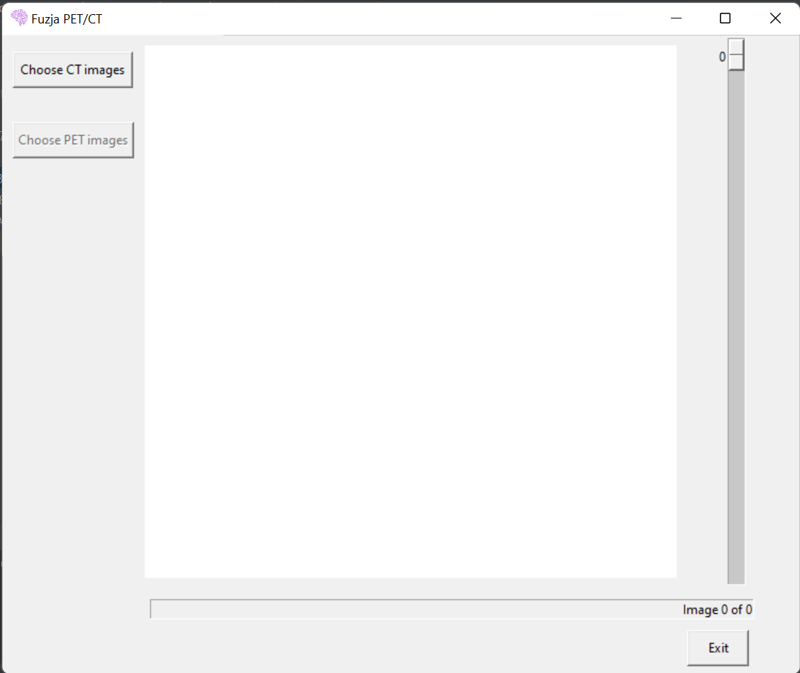

# Temat 7 - fuzja PET-CT

Część 2 projektu z przedmiotu ISMED. Temat 7 - Oprogramowanie do wizualizacji fuzji PET / CT. Oprogramowanie ma załadować badanie PET/CT i wykonać fuzję kolorowego obrazu PET na obraz morfologiczny CT z możliwością oglądania kolejnych warstw.

Aby uruchomić program należy włączyć plik za pomocą komendy 'python3 fusion.py'.
Uprzednio należy zainstalować (plik requirements.txt): 
tkinter (komenda: sudo apt-get install python3-tk) 
pydicom (komenda: pip install -U pydicom) 
matplotlib (komenda: pip install matplotlib) 

Program pozwala wczytać zdjęcia z badania CT oraz badania PET. Aby poprawnie skorzystać z programu, za pomocą przycisku "Choose CT image" proszę wybrać folder, w którym znajdują się zdjęcia z tomografii komputerowej (np. source-images/01-01-2015-NA-PET LUNG-53479/2.000000-LDCT WB-24338). Następnie proszę za pomocą przycisku "Choose PET images" wybrać folder, w którym znajdują się odpowiadające zdjęcia z pozytonowej tomografii emisyjnej (np. source-images/01-01-2015-NA-PET LUNG-53479/49910.000000-OFOVCTAC Body-78905). Za pomocą suwaka można zmieniać bieżącą oglądaną warstwę. Za pomocą przycisku "Exit" można opuścić program.

Screenshots:
 

 

